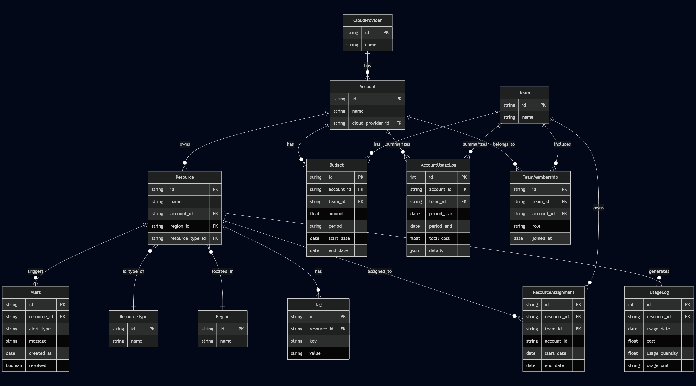

# Design Document

By Zeyad Magdy Ibrahim

Video overview: <https://youtu.be/7aHcIjSkaPs>

## Scope

In this section you should answer the following questions:

* What is the purpose of your database?

    The purpose of this database is to track and analyze the usage, cost, and organization of cloud infrastructure resources across various cloud accounts, providers, and projects. It is intended to help engineering teams and cloud administrators monitor spending, understand resource distribution, and make informed decisions about cost optimization and resource allocation.

* Which people, places, things, etc. are you including in the scope of your database?

        The database includes:

        Cloud providers (e.g., AWS, Azure, GCP)

        Cloud accounts associated with each provider

        Projects or workloads that use cloud resources

        Cloud resources such as virtual machines, databases, storage, and networking components

        Usage and cost records for each resource over time

        Environments (e.g., dev, staging, production) to help categorize projects

* Which people, places, things, etc. are *outside* the scope of your database?

    Individual users or engineers who access the cloud resources

    Performance metrics such as CPU or memory usage per second

    Real-time billing updates or live resource monitoring

    Automated deployment tools like Terraform or Ansible

    Complex pricing models, discounts, or reserved instance logic

    Multi-cloud orchestration or policy enforcement systems

## Functional Requirements

In this section you should answer the following questions:

* What should a user be able to do with your database?

    A user should be able to:

    View all cloud providers and the accounts associated with each

    Track all resources provisioned within cloud accounts, including metadata such as type, region, and environment

    View historical usage and cost data for each resource

    Group resources under specific projects to track project-level cloud spending

    Filter and query cost data by project, environment, account, or provider

    Identify high-cost resources or projects for cost optimization

* What's beyond the scope of what a user should be able to do with your database?

    A user should not be able to:

    Provision, modify, or delete cloud resources through the database

    Perform live monitoring of resource health, performance, or uptime

    Integrate directly with cloud provider APIs for real-time sync

    View user-level access or identity and access management (IAM) details

    Generate invoices or enforce billing policies

## Representation

### Entities:

### Cloud Providers

    The cloud_provider table includes:

    id, which specifies the unique ID for the cloud provider as an INTEGER. This column has the PRIMARY KEY constraint applied.

    name, which specifies the provider's name (e.g., AWS, Azure) as TEXT. This column has NOT NULL since every provider must have a name. A UNIQUE constraint ensures no duplicate provider names.

### Accounts
    The accounts table includes:

    id, which specifies the unique ID for the account as an INTEGER with PRIMARY KEY.

    name, which specifies the account name as TEXT with NOT NULL. Accounts often have descriptive names like "Production" or "Staging".

    cloud_provider_id, which links to the provider as an INTEGER with a FOREIGN KEY constraint referencing cloud_provider(id). This ensures each account belongs to a valid provider.

### Teams
    The teams table includes:

    id, which specifies the unique team ID as an INTEGER with PRIMARY KEY.

    name, which specifies the team name (e.g., "DevOps", "Security") as TEXT with NOT NULL. A UNIQUE constraint prevents duplicate team names.

### Resources
    The resources table includes:

    id, which specifies the unique resource ID as an INTEGER with PRIMARY KEY.

    name, which specifies the resource name (e.g., "web-server-1") as TEXT with NOT NULL.

    account_id, which links to the owning account via INTEGER with FOREIGN KEY referencing accounts(id).

    region_id, which specifies the deployment location via INTEGER with FOREIGN KEY referencing region(id).

    resource_type_id, which categorizes the resource via INTEGER with FOREIGN KEY referencing resource_type(id).

    created_at, which records creation time as TEXT with DEFAULT CURRENT_TIMESTAMP for automatic tracking.

    deleted_at, which marks deletion time as TEXT (nullable) for soft-delete functionality.

### Budgets
    The budget table includes:

    id, which specifies the unique budget ID as an INTEGER with PRIMARY KEY.

    account_id and team_id as INTEGER with FOREIGN KEY constraints linking to respective tables.

    amount, which specifies the budget amount as REAL for precise decimal values.

    period, which specifies the budget cycle (e.g., "monthly") as TEXT.

    start_date and end_date as TEXT in ISO8601 format with NOT NULL constraints.

### Alerts
    The alerts table includes:

    id, which specifies the unique alert ID as an INTEGER with PRIMARY KEY.

    resource_id as INTEGER with FOREIGN KEY referencing resources(id).

    alert_type (e.g., "cost", "performance") as TEXT with NOT NULL.

    message containing details as TEXT.

    created_at as TEXT with DEFAULT CURRENT_TIMESTAMP.

    resolved as INTEGER with CHECK(resolved IN (0,1)) for boolean tracking.

### Resource Usage Logs
    The resource_usage_log table includes:

    id as INTEGER PRIMARY KEY.

    resource_id with FOREIGN KEY constraint.

    usage_date as TEXT in ISO8601 format.

    cost as REAL for monetary precision.

    usage_quantity as REAL to accommodate various units.

    usage_unit (e.g., "GB-hours") as TEXT

### Relationships

The below entity relationship diagram describes the relationships among the entities in the database.

As detailed by the diagram:

    One cloud provider can host 1 to many accounts. An account belongs to one and only one cloud provider. This represents how organizations typically maintain separate accounts (production, staging, etc.) within each cloud platform.

    One account can contain 0 to many resources. A resource belongs to one and only one account. Resources may include compute instances, storage buckets, databases, etc. The 0 minimum accommodates newly created accounts that haven't deployed resources yet.

    One team can be assigned 0 to many resources through resource assignments. A resource can be assigned to 1 to many teams, enabling cross-team collaboration on shared infrastructure. The assignment includes start/end dates for temporal tracking.

    One account can have 1 to many budgets. A budget applies to one and only one account-team pair, ensuring financial accountability for specific team usage within each account.

    One resource can generate 0 to many alerts. An alert pertains to one and only one resource. The 0 minimum allows for properly functioning resources that haven't triggered any alerts.

    One resource can have 0 to many tags. A tag applies to one and only one resource. Tags support flexible categorization without requiring every resource to be tagged.

    One resource can have 0 to many usage log entries. A usage log entry records metrics for one and only one resource at a specific time. The 0 minimum accommodates newly created resources without usage history.

    One team can include 1 to many team memberships. A team membership associates one account with one team, with role-based access control. The 1 minimum ensures every team has at least one member.

    One account can be associated with 0 to many team memberships through account-team relationships. An account isn't required to have team memberships (0 minimum) but can participate in multiple teams.

    These relationships enforce the following business rules:

        All resources must belong to a valid cloud account

        All assignments must reference existing resources and teams

        All usage data must be tied to specific resources

        All financial tracking connects to valid account-team pairs

        Access control flows through proper team membership channels

    The cardinality constraints support:

        Flexible resource sharing across teams

        Granular cost attribution

        Comprehensive monitoring and alerting

        Detailed usage tracking over time

        Role-based access management

## Optimizations

Per the typical queries in queries.sql, it is common for users of the database to retrieve all resources belonging to a specific cloud account or of a particular resource type. For that reason, indexes are created on the account_id and resource_type_id columns in the resources table to speed up these lookups.

    Similarly, users frequently query alert records associated with a specific resource. An index is thus created on the resource_id column in the alerts table to efficiently support this pattern.

    Users often examine resource usage over time or filter by specific resources. As such, indexes are created on the resource_id and usage_date columns in the resource_usage_log table to facilitate both types of access.

    Team and account management queries often involve finding all memberships for a given team or account. Therefore, indexes are created on the account_id and team_id columns in the team_memberships table to support efficient filtering in both directions.

    Budget-related queries often include filtering by either the account or team to view financial constraints. To optimize such operations, indexes are created on the account_id and team_id columns in the budget table.

    To efficiently retrieve resource assignments—whether by team, account, or resource—indexes are created on the resource_id, team_id, and account_id columns in the resource_assignment table.

    Lastly, it is common to filter or group resources based on metadata tags. To optimize these operations, a composite index is created on the key and value columns in the tag table, enabling fast lookups and filtering across both dimensions.

## Limitations

In this section you should answer the following questions:

* What are the limitations of your design?
* What might your database not be able to represent very well?
